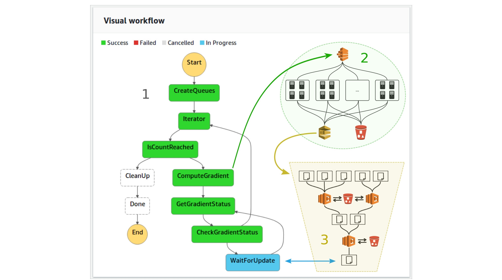

## An event-driven approach to serverless seismic imaging in the cloud

 

This repository contains scripts and instructions to implement the AWS seismic imaging workflow described in "An event-driven approach to serverless seismic imaging in the cloud". The workflow consists of a serverless algorithm implementation using AWS Step Functions and an event-driven map-reduce implementation for computing gradients of objective functions.

 - [IEEE TPDS preprint on arXiv](https://arxiv.org/abs/1909.01279)

### Content

This repository is structured as follows:

 - `batch`: Parameter files for setting up the AWS Batch computing environment.

 - `docker`: Dockerfiles that specify the Docker images used for seismic modeling and imaging in our workflow. A separate Docker image is defined for imaging with and without MPI. This directory also contains the definitions of wave equations using [Devito](https://github.com/opesci/devito), as well as some auxiliary Python functions required for the workflow.

 - `docs`: Documentation for implementing the workflow on AWS. Follow the below link to access the full documentation.

 - `lambda`: Source code of Lambda functions used in the workflow. These include the function for the event-driven gradient summation and automatic submission of AWS Batch jobs.

 - `numerical_examples`: Source code and scripts to reproduce the numerical examples and performance tests.

 - `service_roles`: Parameter files for creating the necessary IAM roles to reproduce the workflow.

 - `step_functions`: Definition of the seismic imaging workflow using AWS Step Functions. The workflow is defined as a json file.

### Instructions for setting up the AWS workflow

Detailed instructions for setting up the workflow on AWS are provided in the [documentation](https://slimgroup.github.io/ServerlessImagingAWS/).
